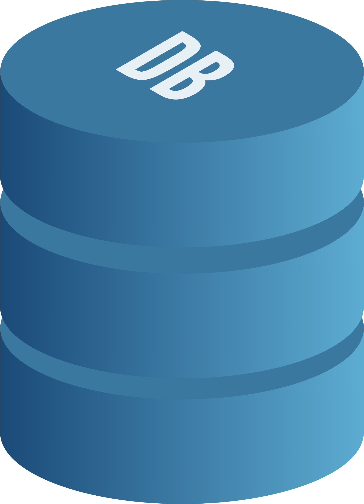

# Frontend for NaturDanmark exam project
Map and Observation for NaturDanmark projekt. Coordinate API , Map API , REST , Coordinate to City API used

**NOTICE**
_______________________________________________________
This is for a school project, just for fun no serious use intended.
All information you upload to an observation will be displayed on the map 
_______________________________________________________

Front end implemented with  JS , HTML , CSS, (Also used : Bootstrap, Vue , Axios)
[Backend implemented with C#](https://github.com/eudk/naturdanmark-api)
_______________________________________________________
- [Selenium tests](https://github.com/eudk/naturdanmark-tests)
- Unittests in the C# code (For model and repository classes) / Testfirst used on most occasions
- Manual usertests done a few times
- POSTMAN tests done
- Continuous deployment used with Github

_______________________________________________________
[Client / Server code w. UDP](https://github.com/eudk/naturdanmark-raspberrypi)

_______________________________________________________
**The Webapp allows you to see and create observations of animals**

By creating new observations you send the following data to a REST service:
- NAME
- LOCATION (SELECTED MANUALLY ON A MAP, OR TRACKED WITH RASPBERRY PI GPS (DATA SENT FROM CLIENT TO SERVER (REST))
- ANIMAL NAME (SELECTED FROM THE ANIMAL API)
- PHOTO  (Photo stored as BASE64 in seperate table)
- DESCRIPTION
- Upload time Automatically
- Observation date and time (automatic or manually selected)
________________________________________________________

**API's used**

Animals API: (Limited to 10.000 free API calls/month)
https://api-ninjas.com/api/animals

Map API & external JS: (Unlimited use)
https://leafletjs.com/index.html

API for converting coordinates to cities: (Unlimited use)
https://www.bigdatacloud.com/free-api/free-reverse-geocode-to-city-api

Own REST service for Animal Observations: (Unlimited use)
https://naturdanmark-api20231124193012.azurewebsites.net/Api/Observation

_________________________________________________________________

Database on Simply.com (Limited to 20GB est. 1000 observations with photos)

_________________________________________________________________
**Previews:**

_________________________________________________________________
**Raspberry Pi Setup images:**

_________________________________________________________________

